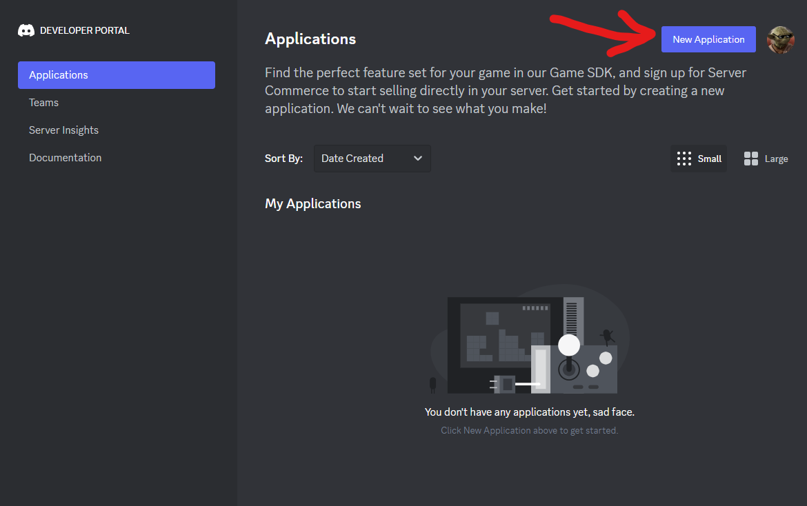
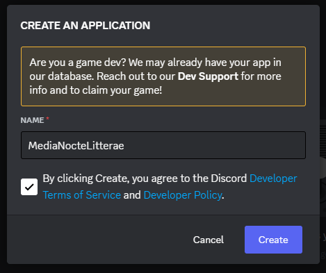
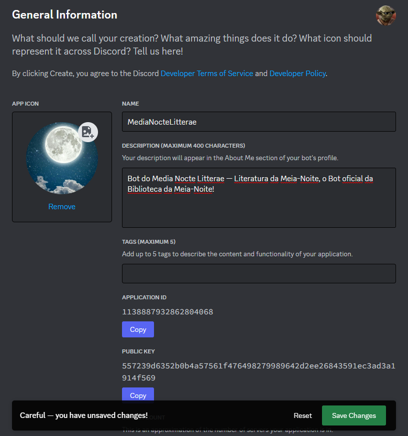
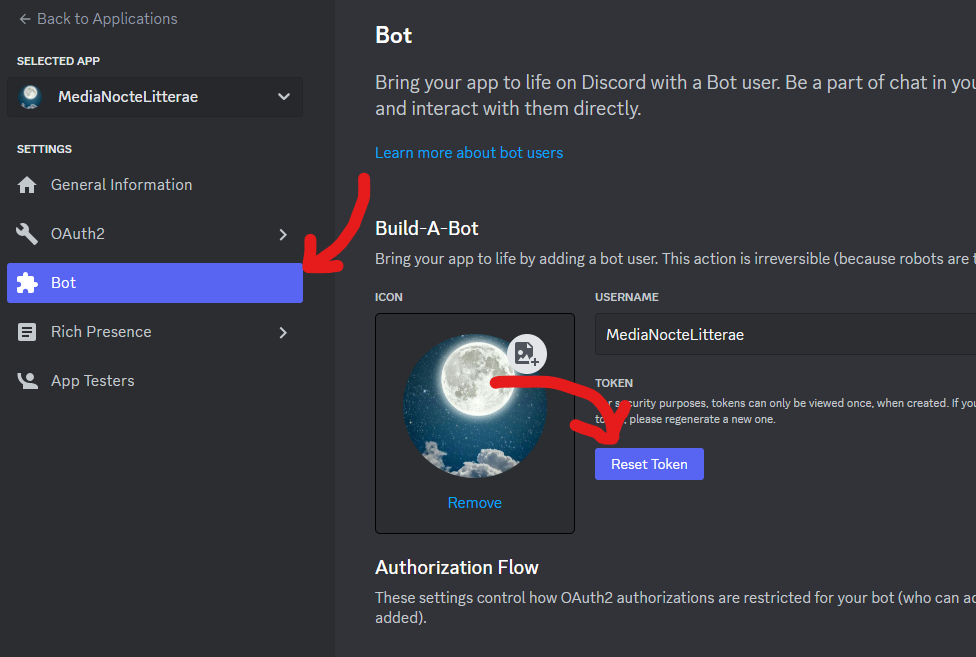
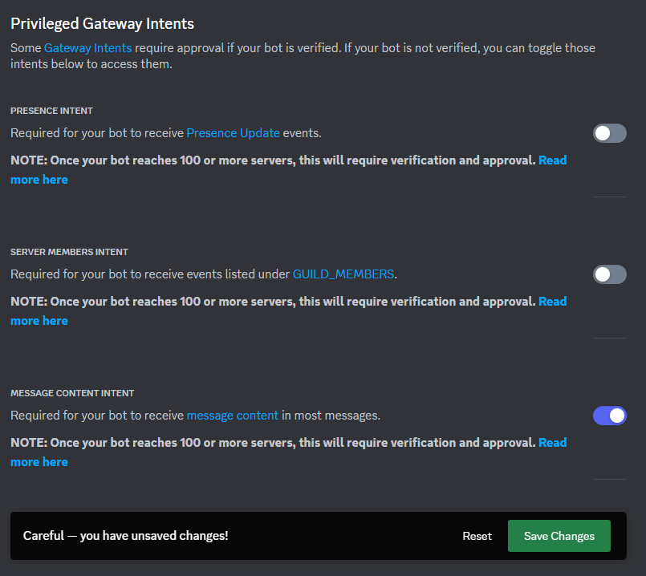
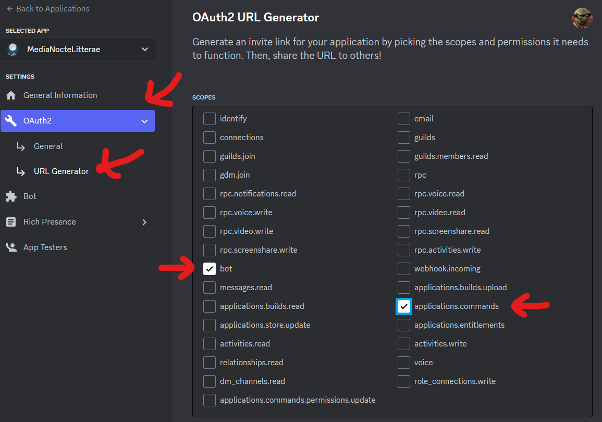
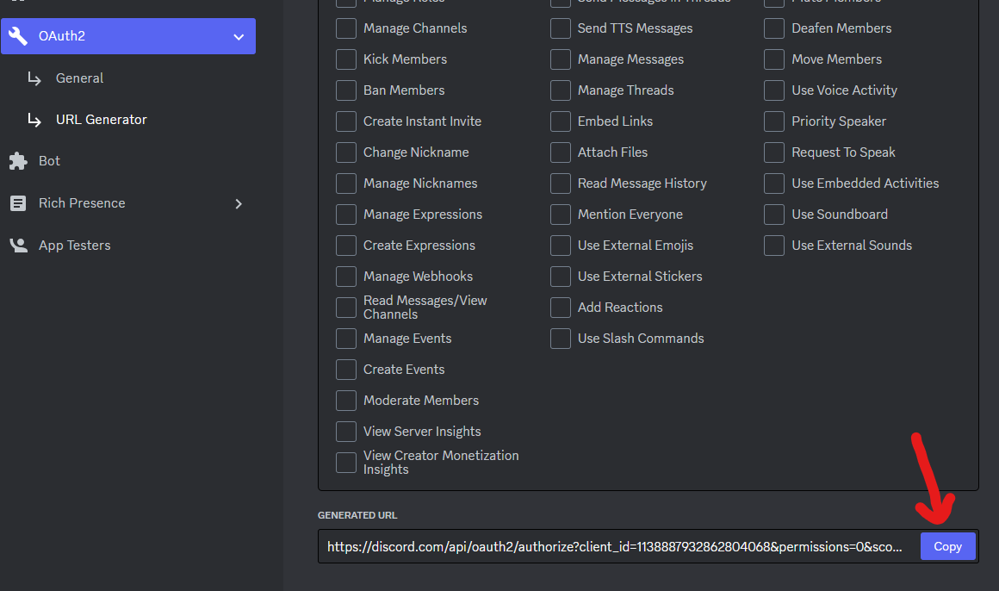
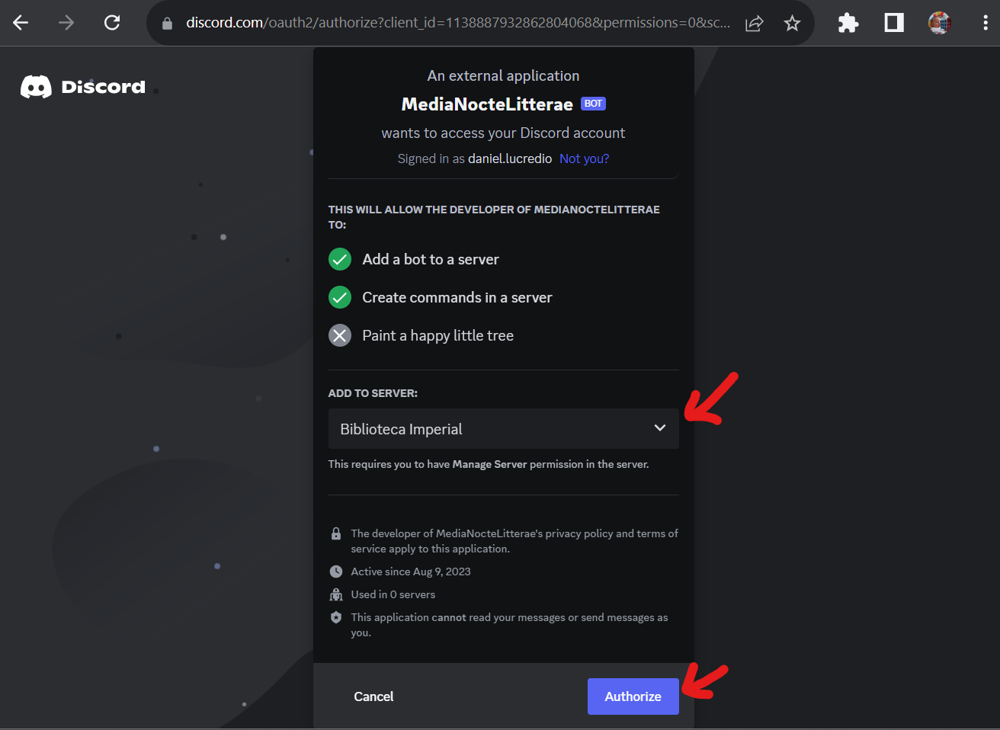
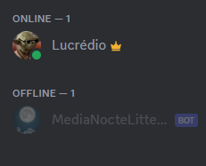

# Configuração do Bot no Discord

Um bot do Discord consiste basicamente de duas partes:

1. Uma aplicação configurada na plataforma do Discord. É aqui que são definidos o nome do bot, seu avatar, descrição, e suas permissões, entre outros detalhes.

2. O bot em si, que consiste em um programa, escrito em uma linguagem de programação, como JavaScript ou Python, que precisa rodar em alguma máquina com acesso à Internet.

Nesta página encontram-se as instruções para configurar a aplicação na plataforma do Discord. Esta configuração deve ser feita por um dos administradores do server.

1. Acessar o portal de desenvolvedores do Discord: [https://discord.com/developers/applications](https://discord.com/developers/applications)

2. Nesse portal, crie uma nova aplicação (caso já não exista), clicando no botão "New Application":

3. Na tela que se abrir, digite o nome da sua aplicação (pode ser o mesmo nome do bot). Selecione também a concordância com os termos de serviço e políticas:

4. Agora é hora de escolher um nome, um ícone e uma descrição. Faça isso na tela que for apresentada. Não esqueça de salvar as mudanças, clicando no botão lá embaixo:

5. O próximo passo é obter o _token_ do bot. Clique no menu `Bot`, no lado esquerdo, e em seguida, no botão `Reset Token`:

Assim que o botão for pressionado, será exibida uma mensagem de confirmação, avisando que seu bot vai parar de funcionar assim que o token for resetado. Caso estiver criando o bot pela primeira vez, obviamente não há problemas em fazer isso. Caso seu bot já esteja rodando, se confirmar ele irá parar de rodar até que você atualize o código-fonte para utilizar o novo token.

Aqui cabe uma breve explicação sobre o que significa isso, pois o token é uma informação de segurança.

> Imagine que você conhece um robô. O nome dele é Andrei. Andrei é legal, gente boa, mas é um robô. Você confiaria em um robô? A resposta é simples: Se foi você mesmo quem construiu o robô, ou se você conhece o robô, então sim! Robôs são confiáveis, principalmente se você puder ver o código-fonte dele.
> 
> Andrei não é apenas legal, ele é útil também. Ele pode ajudar a fazer suas tarefas, lavar a louça, matar baratas e tirar o lixo. Então o que você faz? Dá a chave da sua casa para Andrei.
> 
> Até aqui tudo certo. Andrei mantém a chave no bolso, e mantém-a segura. Ninguém consegue tirar a chave dele enquanto ele está andando na rua.
> 
> O problema é que a chave da sua casa é só um número, facinho de copiar. Se alguém conseguir olhá-la, mesmo que por um segundo, pode reproduzir e aí terá a chave da sua casa. Além disso, Andrei fez uma cópia da chave e deixou em sua própria casa (ou cubículo, Andrei mora em um cubículo). Se alguém invadir o cubículo dele, vai poder copiar sua chave e entrar em sua casa!
> 
> Isso provavelmente não vai acontecer, mas pode acontecer. Então, tem 4 coisas que precisamos: 
> 
> a) nunca deixar a chave à vista;
> 
> b) criar o mínimo possível de cópias da chave;
> 
> c) deixar as cópias protegidas (no bolso do Andrei e no cubículo dele é bem seguro. Outros lugares, não);
> 
> d) sempre que suspeitarmos que a chave for copiada, temos que gerar uma nova IMEDIATAMENTE.*

Chega de literatura e vamos voltar aos bots. Se ainda não percebeu:

Andrei = bot
Chave da sua casa = _token_

E as 4 coisas são:

a) nunca enviar o token, em hipótese alguma, via redes sociais, e-mail, whatsapp, instagram;

b) depois de gerar o token, copie-o e salve-o em sua máquina, de preferência em uma pasta não sincronizada com a nuvem (veremos um local apropriado para isso em outros manuais);

c) vamos ter duas cópias do token: uma na plataforma de nuvem, configurada lá dentro; e outra na máquina da única pessoa que vai implantar o bot. Vamos ver exatamente isso em outros manuais;

d) para gerar um novo token, é só reproduzir o passo 5 deste manual. Entendeu agora porque o botão se chama `Reset Token`?

Pronto, seguindo adiante.

Assim que o botão for clicado, será exibida uma mensagem contendo o token (uma sequência de números, letras maiúsculas, minúsculas e símbolos), e um botão `Copy`. Atenção, assim que você sair desta página, o token irá desaparecer. Se não copiar agora, o mesmo será perdido para sempre, e será necessário gerar um novo.

Depois de copiado, salve-o em um arquivo de texto, em sua máquina.

Antes de sair dessa página, desça um pouco mais até encontrar as opções `Privileged Gateway Intents`, e marque conforme a seguir. Não esqueça de salvar as mudanças:

6. Agora temos que convidar o bot para um servidor. Clique no menu `OAuth2`, depois `URL Generator`, e marque as opções de escopo que forem necessárias. Inicialmente, precisaremos de `bot` e `applications.commands`:

7. Agora desça, nessa mesma página, até o final, até aparecer o texto `Generated URL`. Clique em `Copy`:

8. Abra uma janela do navegador, e cole a URL copiada na barra de endereços. Na janela que se abrir, escolha o servidor no qual deseja adicionar o bot, e clique em `Authorize`:

9. Agora confirme que você não é um robô (seria até legal um robô adicionando outro robô a um server, mas ainda não chegamos nesse nível de robotização) e pronto.

10. Se tudo der certo, seu bot irá aparecer no seu servidor. Ele estará _offline_, é claro, pois ainda não está rodando em lugar nenhum:

