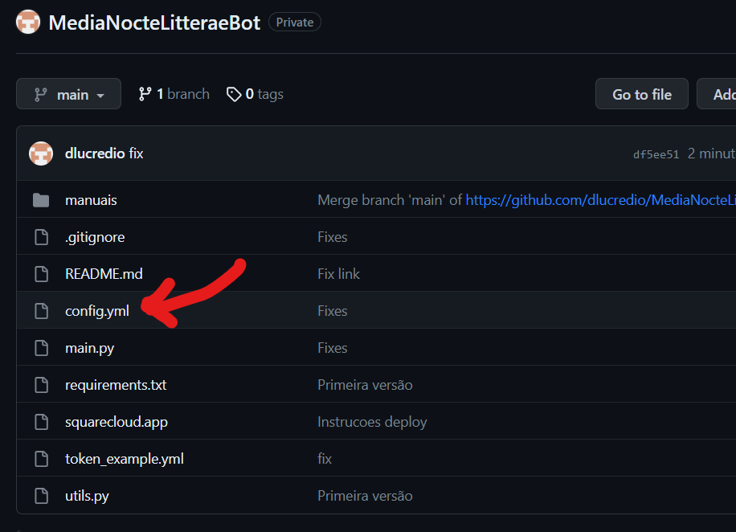
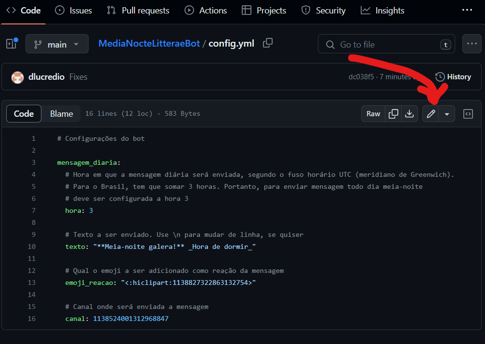
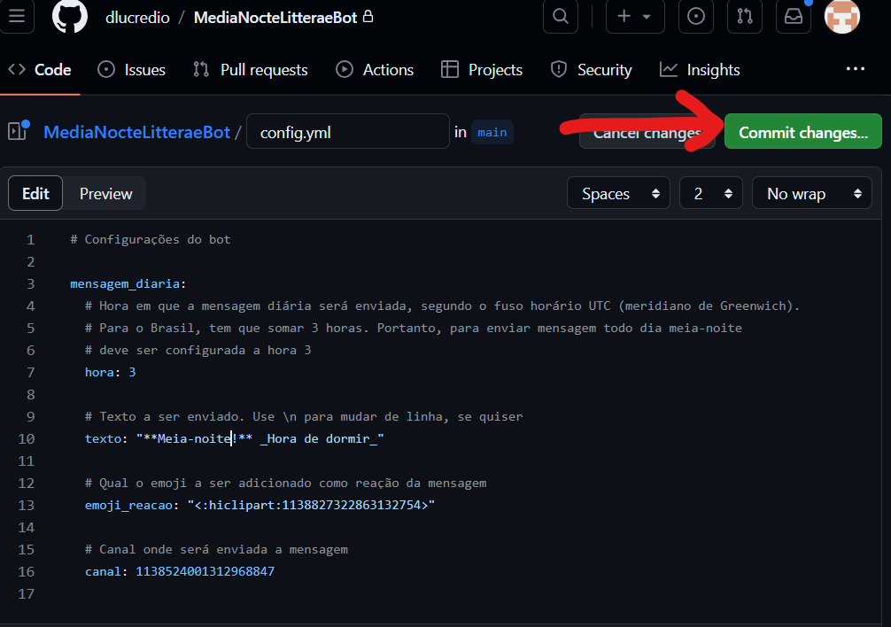
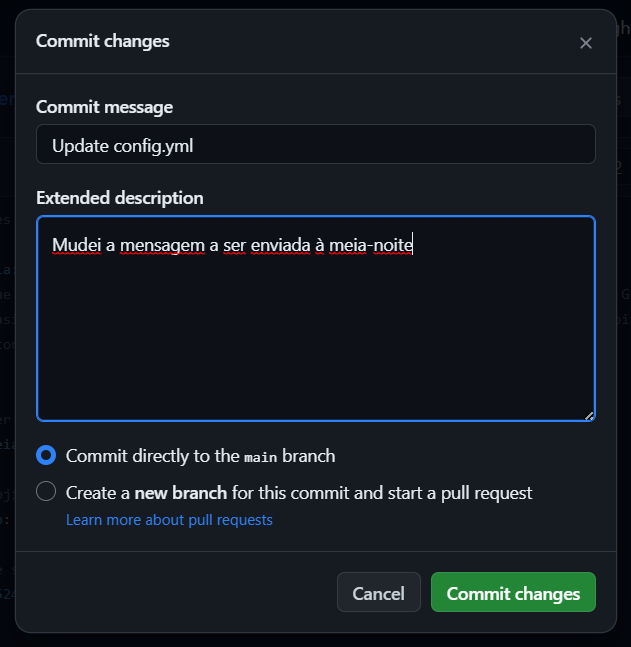

# Customizando o bot

O arquivo `config.yml` tem algumas configurações do bot). O ideal é alterá-lo diretamente no GitHub, assim as mudanças ficam permanentes.

1. Acesse o repositório do bot no GitHub e abra o arquivo `config.yml:

2. Clique no botão de edição. Siga os comentários para entender o que cada configuração faz:

3. Assim que estiver satisfeito, clique em `Commit changes...`

4. Depois, digite uma mensagem que explica o que foi que você mexeu. Pode ser um texto curtinho! Isso é importante para saber quem mexeu no arquivo, e o motivo. Não se preocupe se tiver cometido um erro. É possível reverter qualquer mudança. O GitHub foi feito justamente para isso.

5. Uma vez alterado, refaça [as etapas para hospedar na nuvem](./hospedandoNaNuvem.md), apando a aplicação e subindo-a novamente.

