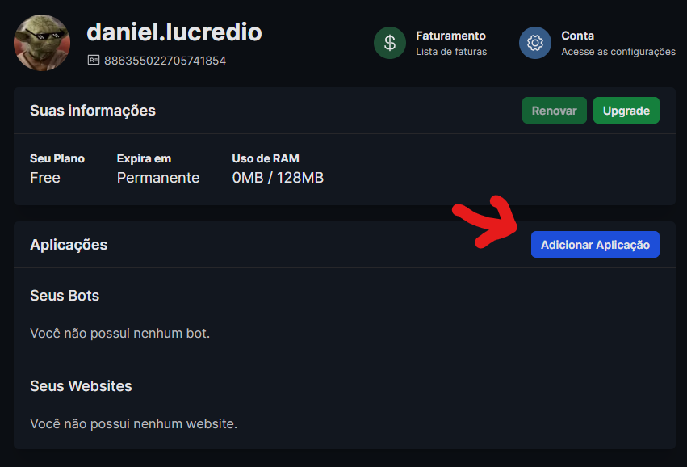
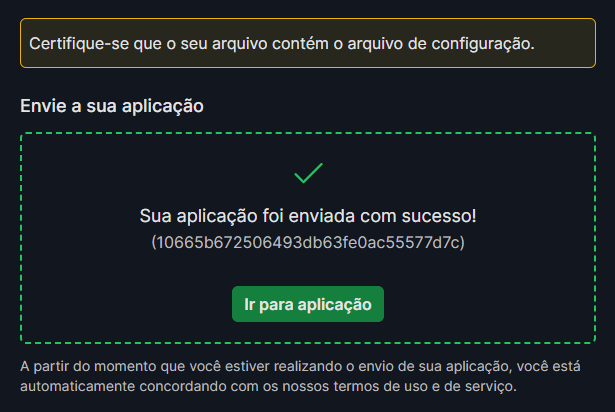
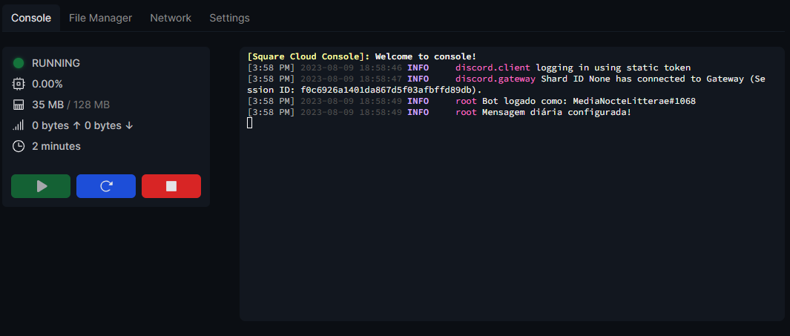
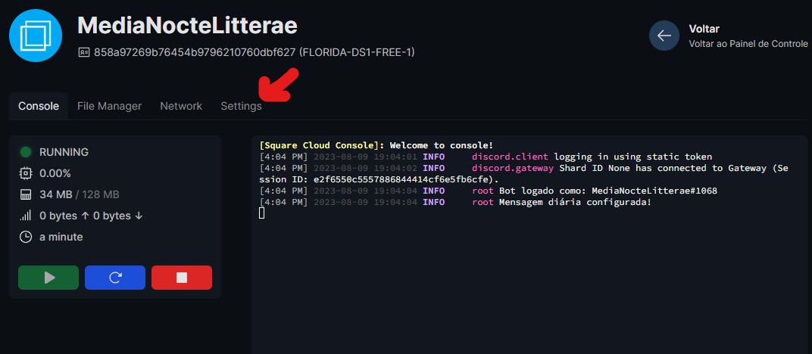
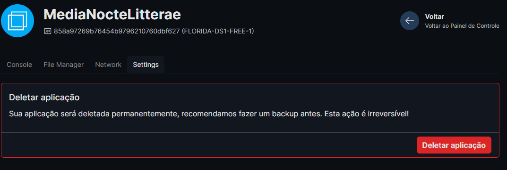

# Como hospedar o bot na nuvem

Um bot do Discord consiste basicamente de duas partes:

1. Uma aplicação configurada na plataforma do Discord. É aqui que são definidos o nome do bot, seu avatar, descrição, e suas permissões, entre outros detalhes.

2. O bot em si, que consiste em um programa, escrito em uma linguagem de programação, como JavaScript ou Python, que precisa rodar em alguma máquina com acesso à Internet.

A primeira parte está explicada [em outro manual](./configuracaoBotDiscord.mdconfigur). Se ainda não fez a configuração, faça primeiro, pois será necessário o _token_ do bot para prosseguir.

Para rodar em uma máquina local, [confira as instruções aqui](./rodandoLocalmente.md), porém isso é recomendado apenas para os desenvolvedores do bot, para testá-lo, criar novas funções, etc.

Nesta página encontram-se as instruções para hospedar o bot gratuitamente na nuvem da SquareCloud.

1. O primeiro passo é baixar o código-fonte do bot. Acesse a página inicial do repositório: [https://github.com/dlucredio/MediaNocteLitteraeBot](https://github.com/dlucredio/MediaNocteLitteraeBot)

Clique no botão `<> Code`, e em seguida `Download ZIP`.

Descompacte o arquivo em algum local de sua máquina.

2. Dentro dessa pasta, existe um arquivo chamado `token_example.yml`. Crie uma cópia deste arquivo, com o nome `token.yml`.

Edite este arquivo e substitua o texto que está na linha marcada com `token_bot` pelo [token que você configurou](./configuracaoBotDiscord.md) para o seu bot.

Uma vez feito isso, crie um novo arquivo `.zip` (tanto faz o nome) contendo todo o conteúdo da pasta. Não é necessário adicionar a pasta `manuais`, nem os arquivos `.gitignore` nem `token_example.yml`. Não faz mal se incluir, mas é bom para economizar espaço.

IMPORTANTE:

Depois que você configurou esse arquivo `config.yml`, já pode apagar o _token_ de onde quer que tenha salvo, assim você minimiza a quantidade de locais onde ele está disponível. Claro, não pode apagar o arquivo `config.yml`, pois agora ele é o único local onde o _token_ está salvo.

3. Agora vá até o site da SquareCloud: [https://squarecloud.app/](https://squarecloud.app/)

4. Faça login usando sua conta do Discord.

5. Na tela que se abrir, selecione a opção `Adicionar Aplicação`

6. Será aberta uma nova página. Arraste o arquivo .zip que acabou de criar aqui, no local indicado. Assim que estiver pronto, será exibida a seguinte página:

Clique em `Ir para aplicação` (ou volte para o início e selecione a aplicação). Você verá o _dashboard_ que indica que a aplicação está rodando, quanta memória está sendo usada, etc.

Espere um pouco, até que o bot seja inicializado. Em poucos minutos, ele estará online e funcionando! Parabéns.

7. Para apagar a aplicação, basta selecionar a opção `Settings` e depois `Deletar aplicação`. Como temos uma cópia no GitHub, não precisa ter medo. É só repetir esses passos para subi-la novamente!

8. Para customizar o bot, acesse o [manual de customização](./customizandoBot.md).