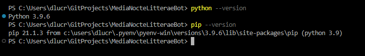
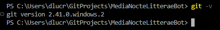

# Rodando um bot localmente

Um bot do Discord consiste basicamente de duas partes:

1. Uma aplicação configurada na plataforma do Discord. É aqui que são definidos o nome do bot, seu avatar, descrição, e suas permissões, entre outros detalhes.

2. O bot em si, que consiste em um programa, escrito em uma linguagem de programação, como JavaScript ou Python, que precisa rodar em alguma máquina com acesso à Internet.

A primeira parte está explicada [em outro manual](./configuracaoBotDiscord.mdconfigur). Se ainda não fez a configuração, faça primeiro, pois será necessário o _token_ do bot para prosseguir.

Nesta página encontram-se as instruções para rodar o bot localmente (na sua máquina). Essas instruções são recomendadas para os desenvolvedores do bot, para testá-lo, criar novas funções, etc.

1. Para rodar este bot, será necessário instalar o [Python](https://www.python.org/), que é uma linguagem de programação. Quando as pessoas dizem que precisa "instalar o Python", o que normalmente querem dizer é "instalar as ferramentas para programar em Python".

Existem muitas formas diferentes de se instalar Python, mas isso não será abordado aqui. Apenas deixamos registrado que é necessário a versão 3.9.6 ou superior.

Qualquer que seja a abordagem de instalação, para funcionar, é preciso abrir um terminal (Linux, Windows ou Mac) e digitar os seguintes comandos (a saída pode variar dependendo do sistema operacional):



Caso isso não aconteça, o Python não foi devidamente instalado.

2. Uma vez instalado o Python, você precisa clonar o repositório com o código-fonte do bot. Esta página se destina a desenvolvedores, portanto recomenda-se o uso do [git](https://git-scm.com/). Instale-o em sua máquina e teste, rodando o seguinte comando (a saída pode variar dependendo do sistema operacional):



3. Agora é necessário configurar sua conta do git. Primeiro, siga as [instruções oficiais](para configurar seu e-mail no site do GitHub).

Em seguida, digite os seguintes comandos, substituindo "Mona Lisa" pelo seu nome e "YOUR_EMAIL" pelo e-mail que acabou de configurar:

`git config --global user.name "Mona Lisa"`
`git config --global user.email "YOUR_EMAIL"`

4. Agora vamos clonar o repositório (copiá-lo para sua máquina, para trabalhar nele). Execute o seguinte comando:

`git clone https://github.com/dlucredio/MediaNocteLitteraeBot.git`

5. Agora entre na pasta recém-criada, usando o terminal, e execute os seguintes comandos:

```sh
python -m venv .venv
pip install -r requirements.txt
```

6. Já está quase tudo pronto para rodar. Só precisamos criar um arquivo de configuração chamado `config.yml`. Siga as [mesmas instruções para hospedar na nuvem](./hospedandoNaNuvem.md) para configurá-lo.

7. Agora basta executar:

`python main.py`

8. Se tudo der certo, o bot ficará online e estará funcionando enquanto o terminal do seu computador estiver aberto.